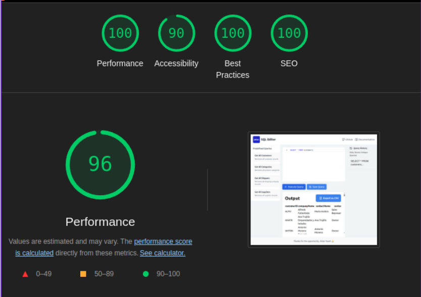

<h1 align="center"> 📝 The SQL-Editor Platform </h1> 

 Crafted with ♥ by Vishal Sharma 
 <h2 align="center">Built using: </h2> 
    

View Demo on the Deployed Site 🚀

Click <a href="https://alpha-beta-blog.netlify.app">https://alpha-beta-blog.netlify.app</a> to view the deployed site

## 👨‍💻 Features

:white_check_mark: Users can get data of any of the predefined SQL queries either by using SQL Editor .\
:white_check_mark: Users can search for a particular data among many records using the search bar.\
:white_check_mark: Users can download the output window table as CSV, with just a single click.

## ✍️ Predefined SQL Queries

- `select * from customers`
- `select * from categories`
- `select * from order_details`
- `select * from shippers`
- `select * from suppliers`

## ⚙️ NPM Modules Used

- `"react-ace": "^14.0.1",` - To make the code editor
- `"react-csv-to-table": "^0.0.4",` - To show the output as a simple CSV table
- `"react-dom": "^19.0.0",` - To interact with React's virtual DOM
- `"react-icons": "^5.5.0", and "lucide-react" : "^7.4.0"` - To have an icon library
- `"react-router-dom": "^7.4.0",` - To implement routing features provided by React.js
- `"react-toastify": "^11.0.5",` - To show the toast notifications for a success or error event
- `"react-csv": "^2.2.2",` - To export the output window table as CSV

## ⏱ Page Load Time

The Webapp loads in about 0.3 s to 0.5s. This is calculated by using Google Lighthouse tool in Chromium based browsers. 

## 🪜 Steps I took to optimize the page load time

- Used useState hooks strategically to minimize unnecessary re-renders
- Used `.webp` assets instead of `.png` or `.jpeg` to minmizing loading time.
- Implemented a 500ms delay in query execution to prevent rapid, unnecessary API calls
- Predefined queries are stored as a constant, preventing redundant computations
- Used PurgeCSS to tree-shake unused styles and optimize my final build size.
- Used Lighthouse DevTools Extension to find the performance issues and fix them using their actionable suggestion.
- Used netlify that has world-class CDN technology that reduces waiting time even further.
- Components are loosely coupled and can be easily code-split

## Available Scripts

In the project directory, you can run:

### `yarn start`

Runs the app in the development mode.\
Open [http://localhost:3000](http://localhost:3000) to view it in the browser.

The page will reload if you make edits.\
You will also see any lint errors in the console.

### `yarn build`

Builds the app for production to the `build` folder.\
It correctly bundles React in production mode and optimizes the build for the best performance.

The build is minified and the filenames include the hashes.\
Your app is ready to be deployed!

## Thanks Atlan for the Oppourtunity ♥ 
